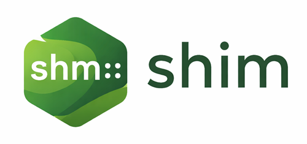

# shim - small c++ header-only libraries

## :label: TLDR;

Small, opinionated, header-only C++ utilities.

## :pencil2: Introduction

I've been writing C++ for a while now (10+ years) and it's high-time I finally turned some of my personal snippets into proper libraries.

So far I've managed to make each library header-only, the idea being they're super simple to drop into any project. I've tried to design them to be clear, understandable and well-documented, with each header attempting to solve one isolated problem.

Given these are libraries I decided to publish more for my own benefit, in terms of polishing the code into a state I consider fit for public consumption and forcing myself to document and test them somewhat, you may find they can be heavily opinionated.

I am open to raised comments and issues but please understand I may not make your requested change. However, please feel free to grab it and adapt it yourself if you so wish, just please respect the licensing!

I don't use AI to write code but I have given in to the dark side a little and let it help with generating the docs and writing the unit tests.

## :package: Libraries

- [shm::event](./docs/event.md)
  A Windows-style event primitive built on top of condition variables that provides simple set/reset/wait semantics.

- [shm::cli](./docs/cli.md)
  A text-first approach to cli parsing with validators, subcommands & auto-help.

- [shm::buffer<T>](./docs/buffer.md)
  I got tired of passing around std::unique_ptr & a size, and often I'm dealing with raw data so don't want the slow down of vector with its value initialisation. What I wanted was essentially an owning version of std::span. I guess sort of what std::dynarray was intended to be.

- [shm::sychronized<T>](./docs/synchronized.md)
  Ever find yourself with a essentially a mutex for every variable when writing multi-thread applications, that you can also easily forget to lock? Try this, its essentially a data wrapping class that enforces synchronized access.

